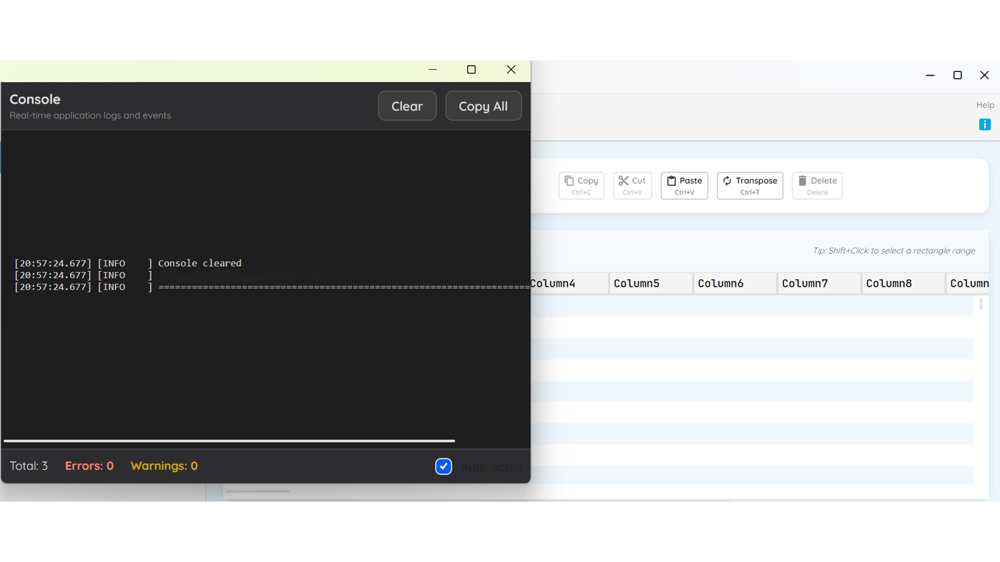

# TemplateBlueprint

A production-ready template for building modern Avalonia desktop applications with TreeDataGrid, navigation, debug console, and data import features.



## NuGet

TemplateBlueprint for Avalonia is published on NuGet:

- [`TemplateBlueprint.Core`](https://www.nuget.org/packages/TemplateBlueprint.Core)
- [`TemplateBlueprint.Controls`](https://www.nuget.org/packages/TemplateBlueprint.Controls)
- [`TemplateBlueprint.AppShell`](https://www.nuget.org/packages/TemplateBlueprint.AppShell)
- [`TemplateBlueprint.Import.Excel`](https://www.nuget.org/packages/TemplateBlueprint.Import.Excel)

Install (example):

```bash
dotnet add package TemplateBlueprint.Core
dotnet add package TemplateBlueprint.Controls
dotnet add package TemplateBlueprint.AppShell
dotnet add package TemplateBlueprint.Import.Excel

```

Publish Status

All 4 packages published successfully:

- TemplateBlueprint.Core 1.0.0
- TemplateBlueprint.Controls 1.0.0
- TemplateBlueprint.AppShell 1.0.0
- TemplateBlueprint.Import.Excel 1.0.0

Your packages will be live in a few minutes:

- https://www.nuget.org/packages/TemplateBlueprint.Core
- https://www.nuget.org/packages/TemplateBlueprint.Controls
- https://www.nuget.org/packages/TemplateBlueprint.AppShell
- https://www.nuget.org/packages/TemplateBlueprint.Import.Excel

Users can install with:

```bash
dotnet add package TemplateBlueprint.AppShell

```

## Features
- **Modern UI Framework**: Avalonia 11.3.8 with Fluent theme
- **High-Performance Data Grid**: TreeDataGrid with search, selection, and clipboard support
- **Navigation System**: Hierarchical sidebar navigation with workspace management
- **Debug Console**: VS Code-style debug console with log capture and redaction
- **Data Import**: CSV import included, optional Excel support via separate package
- **MVVM Architecture**: CommunityToolkit.Mvvm with dependency injection
- **Production-Ready**: First-run detection, settings persistence, unsaved changes prompts

## Project Structure

```
src/
|-- TemplateBlueprint.Core/          # Interfaces and shared types
|-- TemplateBlueprint.Controls/      # TreeDataGrid extensions
|-- TemplateBlueprint.AppShell/      # Navigation, debug console, dialogs
|-- TemplateBlueprint.Import.Excel/  # Optional Excel import (ClosedXML)
`-- TemplateBlueprint.Demo/          # Demo application
samples/                             # Example applications
docs/                                # Documentation

```

## Quick Start

### Prerequisites
- .NET 8.0 SDK or later
- Visual Studio 2022, Rider, or VS Code

### Clone and Build

```bash
git clone https://github.com/Rajioba1/avalonia_template.git
cd avalonia_template
dotnet build

```

### Run Demo

```bash
dotnet run --project src/TemplateBlueprint.Demo

```

## Package Overview

### TemplateBlueprint.Core
Core interfaces that define the "template contracts":
| Interface | Purpose |
|-----------|---------|
| `IWorkspace` | Base workspace for tabbed documents |
| `IWorkspaceHost` | Manages workspace lifecycle |
| `IDialogService` | Platform-agnostic dialogs |
| `IAppSettingsService` | Settings with first-run detection |
| `IRecentFilesService` | Recent files tracking |
| `IDataImportService` | Generic data import |
| `IGridSearchAdapter` | TreeDataGrid search integration |
| `IColumnRoleMapper` | Column role mapping for imports |
| `IProjectDirtyTracker` | Unsaved changes tracking |
| `ILogConsoleSink` | Debug console integration |

### TemplateBlueprint.Controls
TreeDataGrid enhancements:
- `GridSearchAdapter<T>` - Generic search with highlighting
- `CellSelectionBehavior` - Enhanced cell selection
- `ClipboardBehavior` - Copy/paste with tab-separated format
- `FindReplaceBehavior` - Ctrl+F/Ctrl+H support

### TemplateBlueprint.AppShell
Application shell components:
**ViewModels:**
- `NavigatorItemViewModel` - Navigation tree items
- `WorkspaceViewModel` - Base workspace view model
- `WorkspaceManager` - Tab management
**Services:**
- `ConsoleWindowLoggerProvider` - ILoggerProvider for debug console
- `LogRedactionService` - Redacts sensitive data (passwords, tokens)
- `StdOutCaptureService` - Opt-in stdout/stderr capture
- `ProjectDirtyTracker` - Global and workspace-level dirty tracking
**Behaviors:**
- `WindowCloseGuardBehavior` - Unsaved changes prompt
- `KeyboardAcceleratorsBehavior` - Standard shortcuts (Ctrl+S, F12, etc.)
**Controls:**
- `NavigationSidebar` - TreeView navigation
- `WorkspaceTabs` - Tab strip with close buttons
**Windows:**
- `DebugConsoleWindow` - VS Code-style dark console
- `ColumnRoleMapperDialog` - Column mapping for imports

### TemplateBlueprint.Import.Excel (Optional)
Excel file import using ClosedXML:
- Supports .xlsx, .xls, .xlsm files
- Smart type detection (numbers, dates, booleans)
- Configurable header detection

## Usage Examples

### Basic Application Setup

```csharp
// App.axaml.cs
public override void OnFrameworkInitializationCompleted()
{
    var services = new ServiceCollection();
    ConfigureServices(services);
    Services = services.BuildServiceProvider();
    if (ApplicationLifetime is IClassicDesktopStyleApplicationLifetime desktop)
    {
        desktop.MainWindow = new MainWindow
        {
            DataContext = Services.GetRequiredService<MainWindowViewModel>()
        };
    }
    base.OnFrameworkInitializationCompleted();
}
private static void ConfigureServices(IServiceCollection services)
{
    // Logging with debug console
    var loggerProvider = new ConsoleWindowLoggerProvider();
    services.AddSingleton(loggerProvider);
    services.AddLogging(builder => builder.AddProvider(loggerProvider));
    // Core services
    services.AddSingleton<IAppSettingsService, MyAppSettingsService>();
    services.AddSingleton<IDialogService, MyDialogService>();
    services.AddSingleton<IProjectDirtyTracker, ProjectDirtyTracker>();
    // View models
    services.AddTransient<MainWindowViewModel>();
}

```

### Navigation Setup

```csharp
// MainWindowViewModel.cs
public MainWindowViewModel()
{
    NavigatorItems.Add(new NavigatorItemViewModel("Dashboard", "dashboard"));
    NavigatorItems.Add(new NavigatorItemViewModel("Data", "grid"));
    var settingsGroup = NavigatorItemViewModel.CreateGroup("Settings", "settings",
        new NavigatorItemViewModel("General", "settings"),
        new NavigatorItemViewModel("Appearance", "palette"));
    NavigatorItems.Add(settingsGroup);
}

```

### Debug Console

```csharp
// Show debug console
[RelayCommand]
private void ToggleConsole()
{
    if (_consoleWindow == null)
    {
        _consoleWindow = new DebugConsoleWindow();
        _consoleWindow.Connect(_loggerProvider);
        _consoleWindow.Closed += (s, e) => _consoleWindow = null;
    }
    if (_consoleWindow.IsVisible)
        _consoleWindow.Hide();
    else
        _consoleWindow.Show();
}

```

### First-Run Detection

```csharp
// Check for first run
if (_settingsService.IsFirstRun)
{
    _logger.LogInformation("First run - showing welcome");
    _settingsService.MarkFirstRunComplete();
}

```

### Optional Excel Import
To enable Excel import, add the NuGet package:

```bash
dotnet add package TemplateBlueprint.Import.Excel

```

Or add the project reference in your application's .csproj:

```xml
<ProjectReference Include="..\TemplateBlueprint.Import.Excel\TemplateBlueprint.Import.Excel.csproj" />

```

Then detect availability at runtime:

```csharp
public static bool ExcelImportAvailable { get; private set; }
public static void DetectFeatures()
{
    ExcelImportAvailable = Type.GetType(
        "TemplateBlueprint.Import.Excel.ExcelImportService, TemplateBlueprint.Import.Excel"
    ) != null;
}

```

## Configuration

### Directory.Build.props
Shared MSBuild properties for all projects:

```xml
<Project>
  <PropertyGroup>
    <TargetFramework>net8.0</TargetFramework>
    <ImplicitUsings>enable</ImplicitUsings>
    <Nullable>enable</Nullable>
    <AvaloniaVersion>11.3.8</AvaloniaVersion>
    <TreeDataGridVersion>11.0.10</TreeDataGridVersion>
  </PropertyGroup>
</Project>

```

### Customizing the Template
1. **Rename namespaces**: Replace `TemplateBlueprint` with your app name
2. **Add app icon**: Place your icon at `Assets/app-icon.ico`
3. **Customize theme**: Modify styles in `Styles/` folder
4. **Add workspaces**: Extend `WorkspaceViewModel` for your documents

## Disclaimer
This project is an independent template built using Avalonia and is not endorsed by AvaloniaUI OU. Avalonia is a trademark of AvaloniaUI OU.

## License
MIT License - see [LICENSE](LICENSE) for details.

## Attributions
See [ATTRIBUTIONS.md](ATTRIBUTIONS.md) for third-party library credits.

## Contributing
Contributions are welcome! Please read our contributing guidelines before submitting PRs.

## Support
- [GitHub Issues](https://github.com/Rajioba1/avalonia_template/issues)
- [Discussions](https://github.com/Rajioba1/avalonia_template/discussions)
